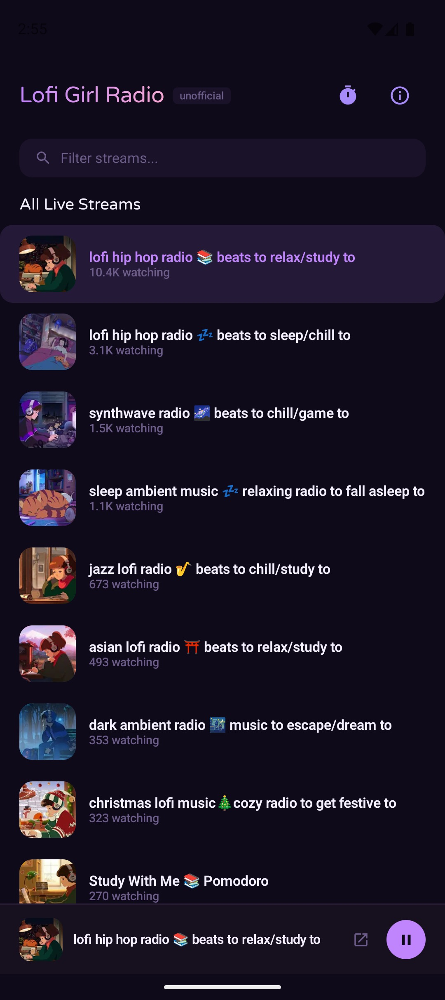

# Lofi Girl Radio

An unofficial Android app for streaming Lofi Girl's live radio channels.

<p align="center">
  
</p>

## Download

Grab the latest APK from the [GitHub Releases](https://github.com/VdustR/lofi-girl-radio-android/releases) page.

| APK variant | Description |
|-------------|-------------|
| `arm64-v8a` | Most modern Android phones (recommended) |
| `armeabi-v7a` | Older 32-bit ARM devices |
| `x86_64` | x86 emulators / Chromebooks |
| `x86` | Older x86 devices |
| `universal` | All architectures (larger size) |

## Features

- **Live Channel List** — Automatically fetches all currently live streams from the Lofi Girl YouTube channel
- **Stream Thumbnails** — Displays live stream thumbnails via Coil image loading
- **Audio Quality Selection** — Choose between Auto, High, Normal, or Low quality streams
- **Background Playback** — Audio continues playing with notification controls when the app is in the background
- **Sleep Timer** — Preset durations (15m/30m/1h/2h) or custom time
- **Fuzzy Search** — Filter channels by name with fuzzy matching
- **Open in YouTube** — Jump to the live stream in YouTube app or browser
- **Google Cast** — Cast audio to Chromecast devices

## Tech Stack

| Layer | Technology |
|-------|-----------|
| Language | Kotlin 2.0+ |
| UI | Jetpack Compose + Material 3 |
| Image Loading | Coil 3 |
| Stream Extraction | NewPipe Extractor |
| Audio Playback | Media3 ExoPlayer + HLS |
| Background Playback | Media3 Session (MediaSessionService) |
| Google Cast | Media3 Cast + Google Cast SDK |
| Architecture | MVVM (ViewModel + StateFlow) |

## Building

```bash
# Debug build
./gradlew assembleDebug

# Release build
./gradlew assembleRelease
```

**Requirements:** Android Studio Ladybug+ or JDK 17+, Android SDK 35

## Specifications

Detailed design documents are in [`docs/spec/`](docs/spec/):

1. [Overview](docs/spec/01-overview.md) — App goals and non-goals
2. [Architecture](docs/spec/02-architecture.md) — Tech stack, MVVM, DI, data flow
3. [Stream Extraction](docs/spec/03-stream-extraction.md) — NewPipe Extractor usage
4. [Playback](docs/spec/04-playback.md) — Media3 HLS playback and background service
5. [Cast](docs/spec/05-cast.md) — Google Cast integration and limitations
6. [UI Design](docs/spec/06-ui-design.md) — UI spec based on mockup
7. [Sleep Timer](docs/spec/07-sleep-timer.md) — Timer logic and persistence
8. [Error Handling](docs/spec/08-error-handling.md) — Error states and retry strategies

## Disclaimer

This is an unofficial, open-source application for personal and educational use only. Not affiliated with or endorsed by Lofi Girl. All streaming content is provided by YouTube and subject to YouTube's Terms of Service.

## License

[MIT](LICENSE)
